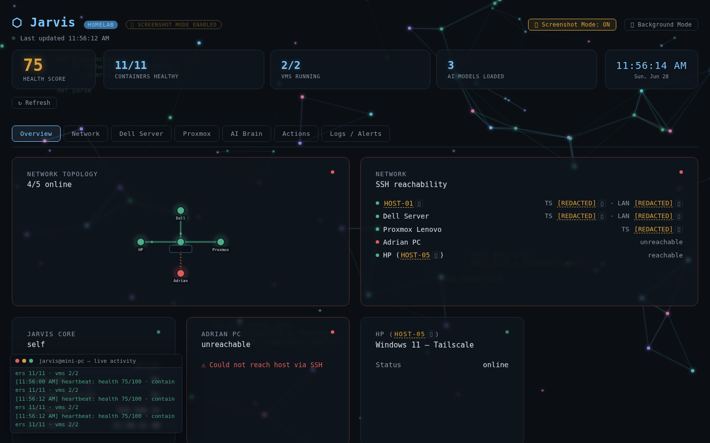
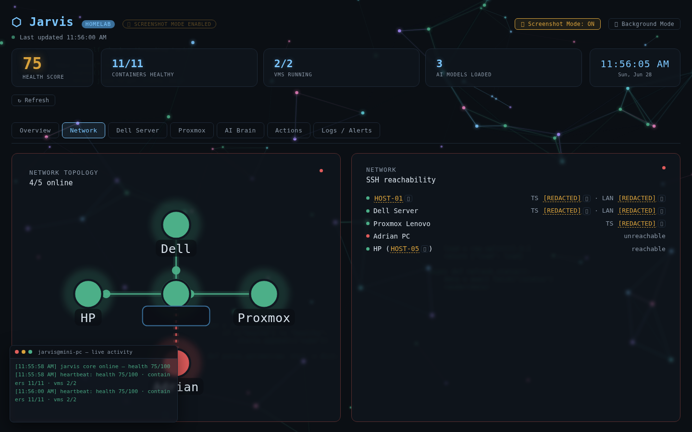
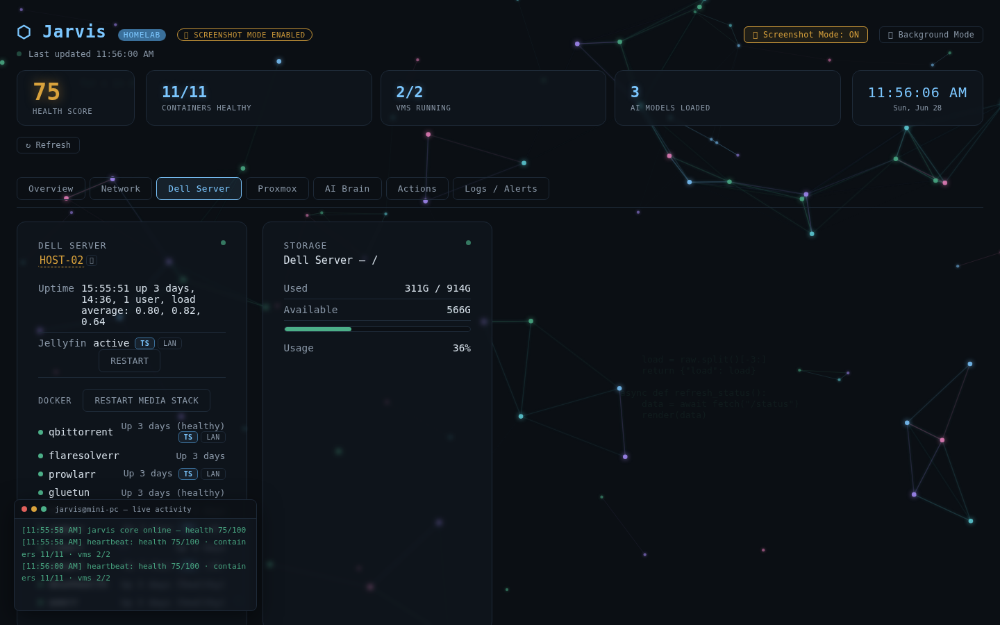
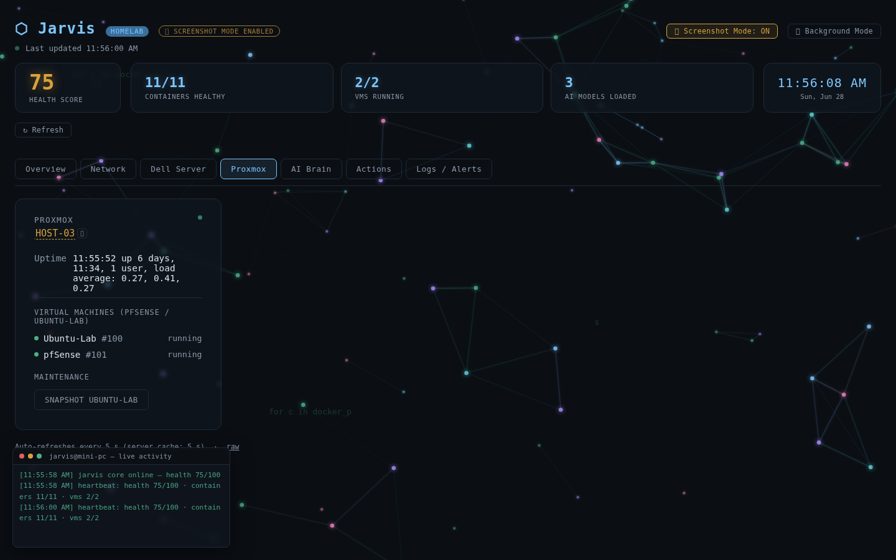
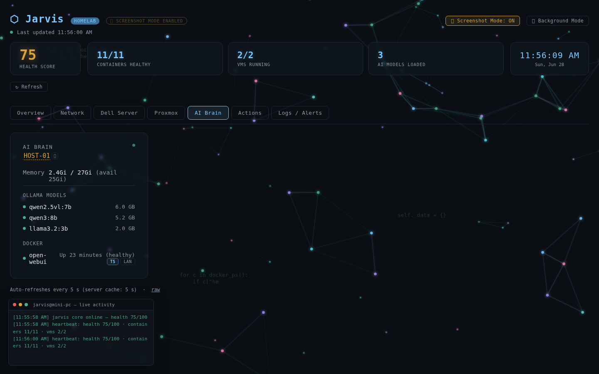
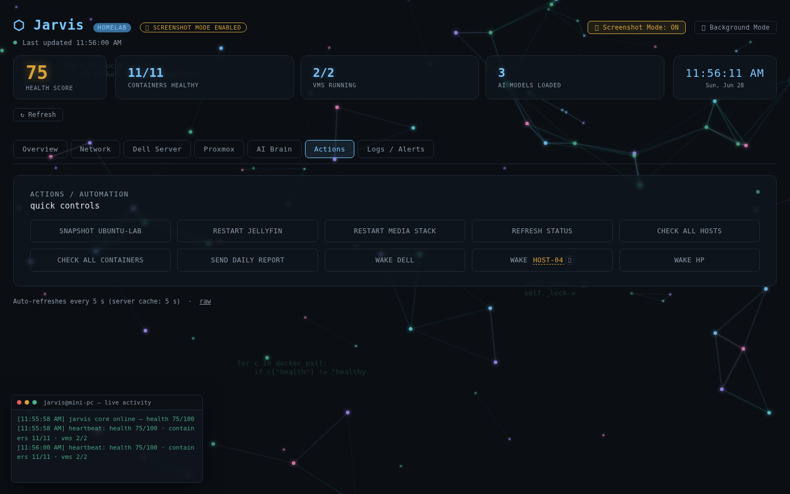
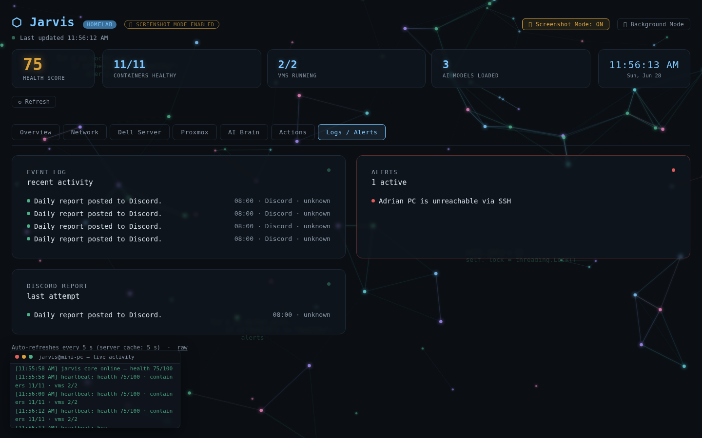

# Jarvis

**A modern AI-powered Homelab Management Platform.**

Jarvis is a self-hosted monitoring and automation platform for a multi-node homelab. It consolidates health and status across every machine in the environment into a single real-time dashboard, and exposes a controlled set of operational actions so routine maintenance no longer requires juggling SSH sessions across multiple hosts.

---

## Features

- **Real-time infrastructure dashboard** — unified health score, container count, VM status, and AI model count at a glance
- **Docker container monitoring** — per-container health tracking with alerts for unhealthy or stopped services
- **Proxmox VM monitoring** — live VM inventory and status from the hypervisor
- **Jellyfin & ARR stack management** — one-click service restarts for media services
- **AI integration (Ollama)** — local LLM model status monitoring and Open WebUI container health
- **Automated health monitoring** — continuous SSH-based checks across all hosts with graceful degradation when a host is offline
- **One-click recovery actions** — restart services, trigger VM snapshots, send daily reports, and more from the Actions panel
- **Wake-on-LAN** — power on offline machines directly from the dashboard
- **Discord notifications** — scheduled daily health summaries delivered to a private Discord channel
- **Tailscale remote access** — all inter-host communication runs over a private Tailscale overlay network
- **Network topology diagram** — animated live diagram with status-colored links between hosts
- **Screenshot Mode** — one-click client-side redaction of IPs, MAC addresses, hostnames, and usernames for safely sharing the dashboard publicly
- **Approval queue** — higher-risk actions route through an approve/reject step before executing
- **Rolling event log** — full audit trail of every action attempt

---

## Screenshots

### Overview



### Network Topology



### Dell Server



### Proxmox



### AI Brain



### Actions



### Logs / Alerts



---

## Architecture

### Network Topology

```
Internet
     │
AT&T Fiber
     │
Flint 2 Router
     │
 ────────────────
 │              │
Dell Server   Mini-PC (Jarvis)
 │              │
Jellyfin      Ollama
ARR Stack     Sentinel
Docker        Dashboard
 │
Proxmox Host
 ├── Ubuntu VM
 ├── Windows VM
 └── pfSense
```

### Machine Roles

| Machine | Role | Services |
|---|---|---|
| **Mini-PC** | AI + Automation Hub | Jarvis dashboard, Ollama (local LLMs), Sentinel, automation scripts |
| **Dell Server** | Media + Storage | Docker, Jellyfin, ARR stack (qBittorrent, Prowlarr, Flaresolverr), primary storage |
| **Lenovo (Proxmox Host)** | Hypervisor | Proxmox VE, Ubuntu Lab VM, Windows Lab VM, pfSense VM |
| **HP** | Windows Lab | Windows 11, Active Directory, Microsoft service testing |

All inter-host communication is tunneled through **Tailscale**, so no ports are exposed to the public internet.

### Application Design

Jarvis runs as a single Flask application with three responsibilities:

1. **Status collection** — a Bash script gathers local system metrics, Docker container state, and AI service status, then pulls equivalent data from remote hosts over SSH with short timeouts so an offline machine degrades gracefully instead of breaking the dashboard.
2. **Presentation** — the Flask app parses and caches that status, renders it as a single-page dashboard, and exposes a `/status` JSON endpoint for programmatic consumption.
3. **Action execution** — token-gated endpoints perform maintenance operations (service restarts, VM snapshots, Wake-on-LAN). Higher-risk actions route through an approve/reject queue, and every attempt is recorded in an event log.

```
            ┌──────────────────────────────┐
            │     Dashboard (Browser)       │
            └──────────────┬───────────────┘
                           │ HTTP
                           ▼
            ┌──────────────────────────────┐
            │   Jarvis (Mini-PC)            │
            │   · Status aggregation        │
            │   · Action dispatch           │
            │   · Event logging             │
            └───┬──────────────────────┬───┘
                │                      │
     Local data │                      │ SSH over Tailscale
                ▼                      ▼
   ┌────────────────────┐   ┌──────────────────────────┐
   │ AI / Automation     │   │ Dell Server (Media)       │
   │ · Ollama            │   │ · Docker containers       │
   │ · Open WebUI        │   │ · Jellyfin / ARR stack    │
   └────────────────────┘   │ Proxmox Host (Lenovo)     │
                             │ · VM inventory             │
                             │ HP / Windows endpoints    │
                             └──────────────────────────┘
```

---

## Tech Stack

- **Backend** — Python, Flask
- **System integration** — Bash, SSH, subprocess
- **Frontend** — HTML, CSS, JavaScript (single-page, no framework)
- **Containerization** — Docker, Docker Compose
- **Virtualization** — Proxmox VE
- **AI / LLM** — Ollama, Open WebUI
- **Networking** — Tailscale (private overlay), Wake-on-LAN
- **Notifications** — Discord webhooks
- **OS** — Ubuntu Linux (Mini-PC, Dell Server), Proxmox VE (Lenovo)

---

## Roadmap

- [x] Real-time multi-host dashboard
- [x] Docker container monitoring and alerting
- [x] Proxmox VM visibility
- [x] AI model status (Ollama)
- [x] One-click maintenance actions
- [x] Wake-on-LAN controls
- [x] Action approval queue
- [x] Discord daily health reports
- [x] Rolling event log
- [x] Network topology diagram
- [x] Screenshot Mode (client-side redaction)
- [ ] Historical metrics and trend graphs
- [ ] Mobile-responsive UI
- [ ] AI voice assistant integration
- [ ] Multi-user authentication
- [ ] Push notifications (replacing polling)
- [ ] Containerized Jarvis deployment
- [ ] Windows VM monitoring (Active Directory, DNS, DHCP)

---

## Lessons Learned

- **Graceful degradation matters more than perfect uptime.** Designing every status check to fail independently (per host, per service) made the dashboard far more useful than one that breaks when a single machine is offline.
- **Gate destructive actions behind review, not just auth.** Token authentication alone wasn't enough peace of mind for operations like snapshots or restarts — adding an approve/reject queue made it safe to automate without losing control.
- **Keep the operational surface small.** Resisting the urge to expose every possible command kept the action API easy to reason about and secure.
- **Logging pays for itself immediately.** A simple event log made debugging "what just happened" far faster than reconstructing it from service logs across multiple hosts.

---

## Security

All credentials, tokens, internal IP addresses, hostnames, SSH keys, and webhook URLs are excluded from this repository and managed outside of source control. See [docs/security.md](docs/security.md) for the full list of what was removed and why.

This repository is a sanitized portfolio version of a private homelab project.

---

## Project Docs

- [Architecture](docs/architecture.md)
- [Features](docs/features.md)
- [Security](docs/security.md)
