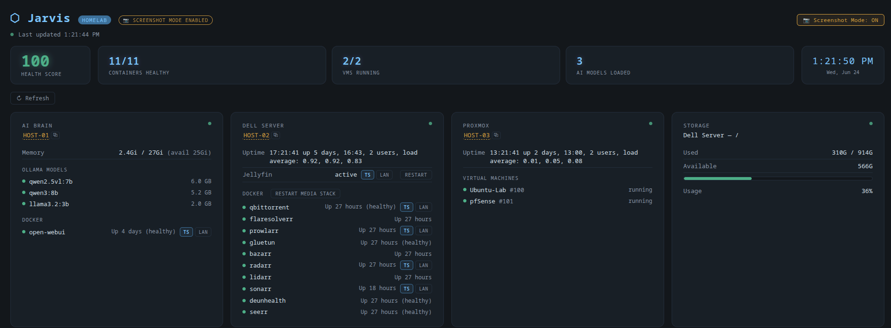
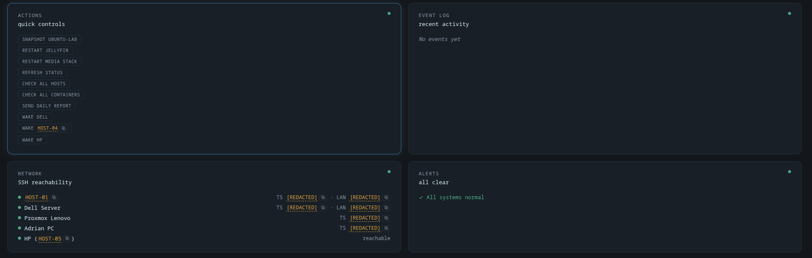
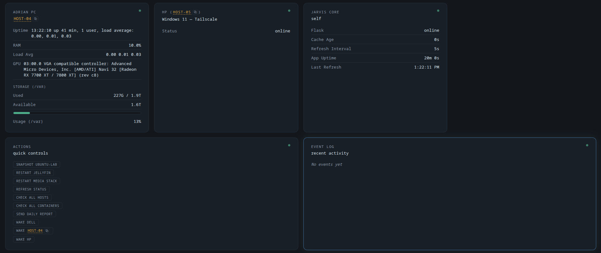

# Screenshots

Screenshots of the Jarvis dashboard will go here.

> Note: before adding real screenshots, double-check they don't reveal hostnames, internal IP addresses, container names tied to personal data, or any other private details. Crop/redact as needed.

## Dashboard — overview

_placeholder — add a screenshot of the main status dashboard (`docs/screenshots/dashboard-main.png`)_

## Host detail panels

_placeholder — add a screenshot showing per-host status (media server, hypervisor, workstation)_

## Network View

_placeholder — add a screenshot of the Network card showing host reachability (`docs/screenshots/network-view.png`)_

## Action queue

_placeholder — add a screenshot of a queued action awaiting approval_

## Event log

_placeholder — add a screenshot of the recent activity/event log_

## Screenshot Mode

A client-side toggle in the top bar redacts sensitive values (Tailscale/LAN IPs, MAC addresses, emails, usernames, hostnames) so the dashboard can be safely captured for docs, GitHub, LinkedIn, or a resume — no backend restart, no real data sent anywhere differently, purely a display-layer transform that can be reversed instantly.

Example of what gets masked:

| Real value | Displayed in Screenshot Mode |
|---|---|
| `100.112.130.85` (Tailscale IP) | `[REDACTED]` |
| `192.168.1.110` (LAN IP) | `[REDACTED]` |
| `10:FF:E0:CA:CF:E5` (MAC address) | `[REDACTED]` |
| `mini-pc` (hostname) | `HOST-01` |

_placeholder — screenshot with Screenshot Mode **on**, showing the "SCREENSHOT MODE ENABLED" badge and `[REDACTED]` values (`docs/screenshots/screenshot-mode.png`). Never publish the "off" version of this one — it defeats the point._
